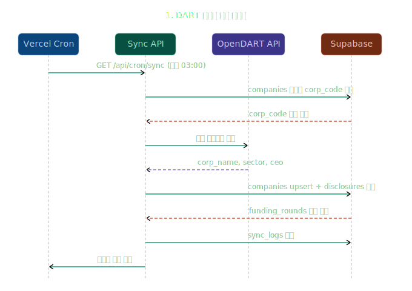
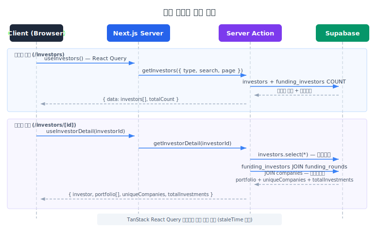
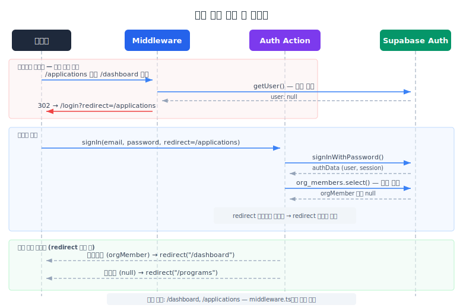

# APPLYKIT

 Korean Startup Investments

한국 스타트업 투자 시장의 정보가 여러 곳에 분산되어 있어 <br>
투자 현황을 한눈에 파악하기 어렵다는 점과 투자사의 지원사업을 공고하고 신청할 수 있는 플랫폼이<br>
한 곳에 존재하면 사용자 경험이 더 나아지겠다는 점에서 프로젝트를 시작했습니다.<br>

DART 공시 데이터를 자동으로 수집하고, 투자 라운드와 투자자 포트폴리오를 <br>
지표로 확인 할 수 있는 플랫폼입니다.


DART OpenAPI 연동 기업/공시/재무 자동 동기화 <br>
투자 라운드 & 투자자 포트폴리오 관리 <br>
운영기관/지원자 역할 기반 접근 제어 <br>
Vercel Cron 일일 자동 업데이트 <br>

---

### Supabase 데이터 설계

```
supabase/
├── companies/                # 기업 정보 (DART 동기화)
├── financials/               # 재무제표 (매출, 영업이익, 당기순이익)
├── disclosures/              # DART 공시 내역
├── funding_rounds/           # 투자 라운드 (Seed ~ IPO)
├── investors/                # 투자자 정보 (VC, CVC, Accelerator)
├── funding_investors/        # 투자자-라운드 연결 (M:N)
├── programs/                 # 지원 프로그램 공고
├── applications/             # 지원서
├── organizations/            # 운영기관
├── org_members/              # 운영기관 멤버 (역할 판별)
└── sync_logs/                # 동기화 실행 로그
```

### 1. DART 데이터 자동 동기화

### 2. 투자 데이터 조회

### 3. 역할 기반 인증

