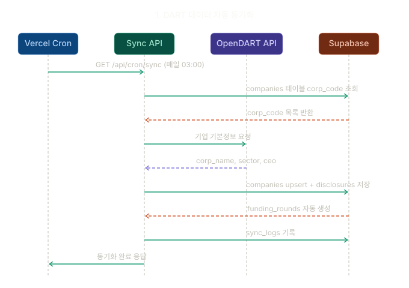
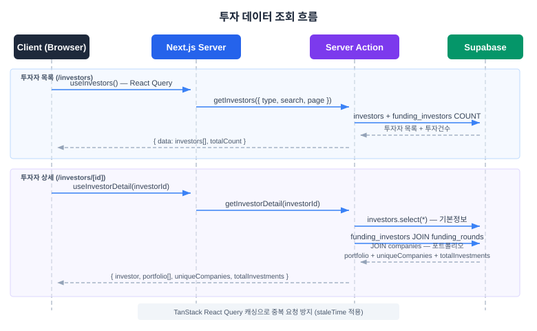
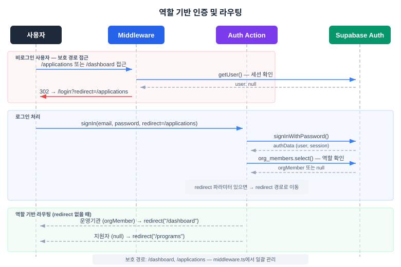

# APPLYKIT

> **Korean Startup Investments** — 한국 스타트업 투자 데이터와 지원사업 운영을 한 곳에서

한국 스타트업 투자 정보는 여러 곳에 흩어져 있어 투자 현황을 한눈에 보기 어렵습니다. 투자사가 지원사업을 공고하고 스타트업이 신청하는 과정도 플랫폼마다 따로 이뤄집니다.
ApplyKit은 이 두 가지를 하나로 묶기 위해 시작했습니다. **DART 공시 데이터를 자동으로 수집해 투자 라운드와 투자자 포트폴리오를 지표로 보여주고**, 운영기관이 **지원사업 공고부터 지원서 접수, 심사까지** 관리할 수 있는 플랫폼입니다.

**배포** https://applykit-smoky.vercel.app

<br>

## 주요 기능

### 📊 투자 데이터
- **홈 대시보드**: 전체 투자 건수·금액, 이번 달 투자 현황과 전년 동월 비교, 최근 투자 라운드
- **투자 라운드 목록**: 단계별 탭(Seed~Pre-A / Series A / Series B~C / Series D+ / IPO / M&A) 필터링과 페이지네이션
- **기업 상세**: 기업 정보, 재무제표 차트(매출·영업이익·당기순이익), 투자 라운드 타임라인, 공시 내역
- **투자자 상세**: VC · CVC · 액셀러레이터 정보와 포트폴리오
- **통합 검색**: 기업·투자자를 한 번에 검색 (입력 디바운스 적용)

### 🔄 DART 데이터 자동 동기화
- DART OpenAPI로 기업 개황, 공시, 재무제표를 수집해 Supabase에 저장
- 요청 간 지연과 배치 처리로 API 호출 한도 대응
- **공시 제목 기반 투자 이벤트 감지**: 제3자배정 유상증자 등의 패턴을 감지해 투자 라운드를 자동 생성
- Vercel Cron으로 **매일 KST 03:00** 증분 동기화, 실행 결과는 `sync_logs`에 기록
- 대량 초기 적재용 스크립트(`src/scripts/bulk-sync.ts`) 제공

### 📰 스타트업 뉴스
- 네이버 뉴스 검색 API로 스타트업·투자 관련 뉴스를 수집 (**매일 KST 04:00**, 투자 동기화와 분리된 크론)
- 제외 키워드 필터링, HTML 정제, 중복 제거, 언론사 추출
- 180일이 지난 뉴스 자동 정리
- 홈 화면에 뉴스 섹션과 자동 전환(롤링) 헤드라인 표시

### 📝 지원사업 운영 (운영기관)
- 지원 프로그램 **생성 · 수정 · 삭제**
- **지원서 폼 빌더**: 텍스트, 이메일, 전화번호, 숫자, 날짜, 선택형, 체크박스, 파일 업로드 등 필드를 구성하고 미리보기
- 프로그램별 접수 현황 통계(총 접수 / 완료 / 미완성 / 오늘 접수)와 지원서 목록

### ✅ 심사
- 프로그램별 **심사 체크리스트** 작성 (항목별 배점)
- 지원서마다 항목 점수 입력 → 총점 자동 계산, 합격/불합격 판정
- **심사 이력 아카이브**: 회사명으로 과거 심사 결과 검색, 기존 이력의 회사명 일괄 보정(backfill)

### 🙋 지원 (지원자)
- 공개된 지원사업 목록과 상세 조회
- 폼 빌더로 만든 양식에 맞춰 지원서 작성 · 제출, 내 지원서 확인
- **첨부파일 업로드**: PDF, Excel(.xlsx)을 Supabase Storage에 저장하고 서명된 URL로 열람

### 🔐 인증 · 권한
- Supabase Auth 기반 회원가입 · 로그인
- **운영기관 / 지원자 역할 기반 접근 제어**: `org_members`로 역할을 판별하고, 테이블별 RLS 정책으로 데이터 접근 제한
- `proxy.ts`에서 `/dashboard`, `/applications` 등 로그인 필요 경로 보호

### 🔍 SEO
- `sitemap.ts`, `robots.ts`로 사이트맵과 크롤링 규칙 생성

<br>

## 기술 스택

| 구분 | 사용 기술 |
|------|-----------|
| Framework | Next.js 16 (App Router, Server Actions), React 19 |
| Language | TypeScript |
| Styling | Tailwind CSS 4, shadcn/ui (Radix UI), Pretendard, CSS 변수 기반 다크 네이비 디자인 토큰 |
| 상태 관리 | TanStack Query (서버 상태), Zustand (폼 빌더 · 체크리스트 등 클라이언트 상태) |
| 차트 | Recharts |
| Backend | Supabase (PostgreSQL, Auth, RLS, Storage) |
| 외부 API | DART OpenAPI, 네이버 뉴스 검색 API |
| 배포 · 자동화 | Vercel, Vercel Cron Jobs |
| 테스트 · CI | Jest, GitHub Actions (타입 체크 → ESLint → 테스트 → 빌드) |

<br>

## 화면 구성

| 경로 | 설명 |
|------|------|
| `/` | 홈 (투자 지표, 최근 투자, 스타트업 뉴스) |
| `/investments` | 투자 라운드 목록 |
| `/companies`, `/companies/[id]` | 기업 목록 · 상세 |
| `/investors`, `/investors/[id]` | 투자자 목록 · 상세 |
| `/programs`, `/programs/[id]` | 지원사업 목록 · 상세 |
| `/programs/[id]/apply` | 지원서 작성 |
| `/applications`, `/applications/[id]` | 내 지원서 |
| `/dashboard` | 운영기관 대시보드 |
| `/dashboard/programs/[id]` | 프로그램 관리 · 폼 빌더 · 접수 현황 |
| `/dashboard/programs/[id]/applications/[appId]` | 지원서 열람 · 심사 |
| `/dashboard/archive` | 심사 이력 아카이브 |
| `/login`, `/signup` | 로그인 · 회원가입 |

<br>

## 프로젝트 구조

```
src/
├── app/
│   ├── actions/          # Server Actions (프로그램, 지원서, 첨부파일, 심사, 검색, 대시보드)
│   ├── api/
│   │   ├── cron/         # Vercel Cron (DART 동기화, 뉴스 수집)
│   │   ├── dart/         # DART 검색 · 수동 동기화
│   │   └── admin/        # 관리자용 시드 · 뉴스 수동 수집
│   └── ...               # 페이지 (App Router)
├── components/           # 도메인별 UI (companies, investments, dashboard, review, application)
├── hooks/                # TanStack Query 훅
├── stores/               # Zustand 스토어
├── lib/
│   ├── dart/             # DART 클라이언트 · 동기화 · 투자 이벤트 파서
│   ├── naver/            # 네이버 뉴스 클라이언트 · 필터 · 정제 · 동기화
│   ├── review/           # 심사 점수 계산 · 회사명 추출
│   ├── file/             # 업로드 허용 파일 규칙
│   └── supabase/         # 브라우저 / 서버 클라이언트
├── types/                # 도메인 타입
├── scripts/              # 대량 동기화 · 시드 스크립트
└── proxy.ts              # 인증 경로 보호
supabase/migrations/      # DB 마이그레이션 (심사, 뉴스 테이블 · RLS 정책)
```

<br>

## Supabase 데이터 설계

```
supabase/
├── companies/                # 기업 정보 (DART 동기화)
├── financials/               # 재무제표 (매출, 영업이익, 당기순이익)
├── disclosures/              # DART 공시 내역
├── funding_rounds/           # 투자 라운드 (Seed ~ IPO, M&A)
├── investors/                # 투자자 정보 (VC, CVC, Accelerator)
├── funding_investors/        # 투자자-라운드 연결 (M:N)
├── programs/                 # 지원 프로그램 공고 (폼 스키마 포함)
├── applications/             # 지원서 (draft → submitted → passed / failed)
├── review_checklists/        # 프로그램별 심사 체크리스트
├── review_results/           # 지원서별 심사 결과 · 점수
├── startup_news/             # 스타트업 뉴스 (네이버 뉴스 API)
├── organizations/            # 운영기관
├── org_members/              # 운영기관 멤버 (역할 판별)
└── sync_logs/                # 동기화 실행 로그
```

<br>

## 주요 흐름

### 1. DART 데이터 자동 동기화


### 2. 투자 데이터 조회


### 3. 역할 기반 인증


<br>

## 문서

- [기능명세서 — 스타트업 뉴스 수집 v2](./docs/기능명세서-스타트업뉴스-v2.md)
- [화면명세서 — 스타트업 뉴스 홈](./docs/화면명세서-스타트업뉴스-홈.md)

<br>

## 로컬 실행

```bash
git clone https://github.com/oldwater0224/applykit.git
cd applykit
npm install
npm run dev      # http://localhost:3001
npm test         # Jest 단위 테스트
```

프로젝트 루트에 `.env.local`을 만들고 아래 값을 채워야 합니다.

```env
# Supabase
NEXT_PUBLIC_SUPABASE_URL=
NEXT_PUBLIC_SUPABASE_ANON_KEY=
SUPABASE_SERVICE_ROLE_KEY=        # 서버 전용 (크론 · 동기화)

# 외부 API
DART_API_KEY=
NAVER_CLIENT_ID=
NAVER_CLIENT_SECRET=

# 크론 · 동기화 인증
CRON_SECRET=
DART_SYNC_SECRET=

NEXT_PUBLIC_APP_URL=http://localhost:3001
```

> 크론 스케줄은 `vercel.json`에 UTC 기준으로 정의되어 있습니다. (`0 18 * * *` = KST 03:00 DART 동기화, `0 19 * * *` = KST 04:00 뉴스 수집)
